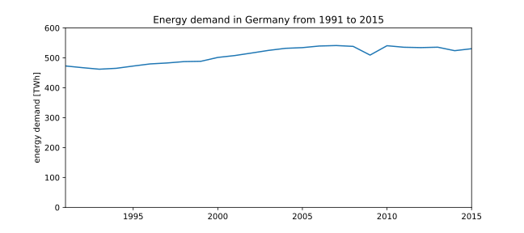

Static data functions
~~~~~~~~~~~~~~~~~~~~~

Energy Balance
==============

Get the energy balance of the federal states for a given year. The data is
taken from a csv-file that is manually downloaded from the LAK page.

https://www.lak-energiebilanzen.de/eingabe-dynamisch/?a=e900

As an automatic download does not work you may have to download the file to
get the latest updates. Just rename the downloaded file to
`energy_balance_federal_states.csv` and replace the existing file in the
`data/static/` directory of the reegis package. Alternatively you can download
the file and adapt the path in the config file
(`energy_balance: energy_balance_states`) or use the config module to set a
ne path.

Usage with file in the default directory:

.. code-block:: python

    from reegis import energy_balance as eb

    year = 2012
    states = ['BB', 'NW']
    fuel = 'lignite (raw)'
    row = 'extraction'

    my_eb = eb.get_states_energy_balance(year)
    print(my_eb.loc[(states, row), fuel])

Usage with alternative file:

.. code-block:: python

    from reegis import energy_balance as eb, config as cfg

    year = 2012
    states = ['BB', 'NW']
    fuel = 'lignite (raw)'
    row = 'extraction'
    fn = '/my/path/my_file.csv'

    cfg.tmp_set('energy_balance', 'energy_balance_states', fn)
    my_eb = eb.get_states_energy_balance(year)
    print(my_eb.loc[(states, row), fuel])

If no year is passed to the function the whole table will be returned. This can
be used to show changes over the time.

.. code-block:: python

    from matplotlib import pyplot as plt
    from reegis import energy_balance as eb

    fuel = 'lignite (raw)'
    ax = plt.figure(figsize=(9, 5)).add_subplot(1, 1, 1)

    my_eb = eb.get_states_energy_balance()
    my_eb.loc[(slice(None), slice(None), 'extraction'), fuel].groupby(
        level=0).sum().plot(ax=ax)
    plt.title("Extraction of raw lignite in Germany")
    plt.xlabel('year')
    plt.ylabel('energy [TJ]')
    plt.ylim(bottom=0)
    plt.show()

.. image:: _files/energy_balance_lignite_extraction.svg
  :width: 650
  :align: center

The full code of the plot can be found here
:py:func:`~reegis.dev.figures.fig_energy_balance_lignite_extraction`.

The reason for the drop for the last year is not that extraction of raw
extraction ended but that the data set for 2016 is not complete yet. So be
careful with most recent data sets and check them before use.

If you frequently work with energy balances please contact the author and give
your feedback or help to improve and maintain the API.

For the full API see :py:mod:`~reegis.energy_balance` .

.. _bmwi_label:

Energy data from the energy ministry (BMWi)
=================================================

The ministry of energy
`BMWI <http://www.bmwi.de/Navigation/EN/Home/home.html>`_ provides an excel
sheet which is not optimised for automatic data processing. Nevertheless, it
is possible to get some basic data from there. Be careful with updates, because
the structure of the sheets may vary in the future.

Annual electricity demand
#########################

Fetch the annual electricity demand from 1991 on. In the following code example
it is used to create a time series.

.. code-block:: python

    demand = pd.Series()
    ax = plt.figure(figsize=(9, 4)).add_subplot(1, 1, 1)
    for year in range(1991, 2016):
        print(year)
        demand.loc[year] = bmwi.get_annual_electricity_demand_bmwi(year)
    print(demand)

The full code of the plot can be found here
:py:func:`~reegis.dev.figures.fig_energy_demand_germany_bmwi`.

Capacity of renewable energy plants
###################################

The example shows the capacity of hydro energy plants in Germany in 2016.

.. code-block:: python

    re = bmwi_re_energy_capacity()
    print(re.loc[2016, ('water', 'capacity')])

If you frequently work with BMWi data please contact the author and give
your feedback or help to improve and maintain the API.

For the full API see :py:mod:`~reegis.bmwi` .

.. _entsoe_label:

Demand profile from ENTSO-E
===========================

The electricity profile is taken from ENTSO-E time series provided by
`OPSD demand time series <https://github.com/Open-Power-System-Data/national_generation_capacity>`_.

.. code-block:: python

    entsoe = get_entsoe_load(2015)

For the full API see :py:mod:`~reegis.entsoe` .
