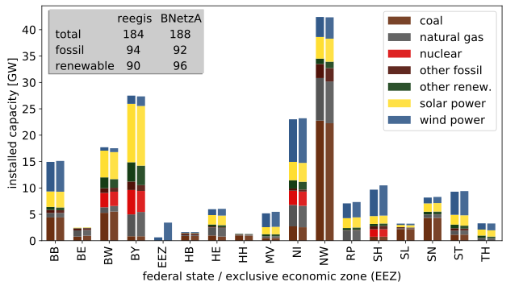
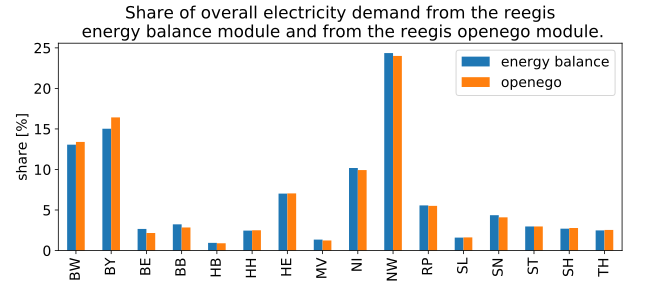
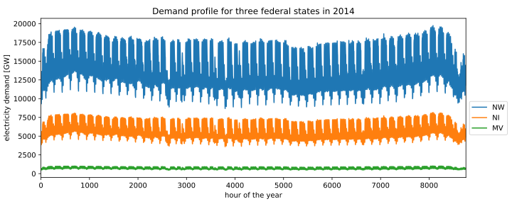
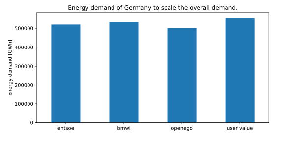

Spatial data functions
~~~~~~~~~~~~~~~~~~~~~~

Power plants
============

The powerplant module is based on
`OPSD <https://open-power-system-data.org/>`_.

Get the capacity of powerplants for given regions and a specific year. Use
the pandas functions to process the result. The code below will show a typical
plot with the capacity for every federal state by fuel for the year 2014.

.. code-block:: python

    from matplotlib import pyplot as plt
    from reegis import powerplants
    geometries=geo.get_federal_states_polygon()
    year=2014
    my_pp=powerplants.get_powerplants_by_region(
        geometries, year, 'federal_states')
    column='capacity_{0}'.format(year)
    my_pp[column].unstack().plot(kind='bar', stacked=True)
    plt.show()

To validate the function the results have been compared to data from the
Federal Network Agency (BNetzA). The following plot shows the results of reegis
on the left and the data from the BNetzA on the right. Some of the differences
between reegis and BNetzA are caused by the different methods. Power plants
that were put into operation in the given year are taken only partly into
account, proportional to the running time in the given year. Typically
renewable power plants are mainly build in the second have of the year. The
BNetzA take all powerplants into account that were build until a specific
dead line. For an energy model of the year 2014 the reegis method makes more
sense.

The full code of the plot can be found here
:py:func:`~reegis.dev.figures.fig_powerplants`.

For the full API see :py:mod:`~reegis.powerplants` .

Inhabitants
============

The inhabitants data come from the
`Federal Agency for Cartography and Geodesy (BKG) <https://gdz.bkg.bund.de/index.php/default/open-data/verwaltungsgebiete-1-250-000-mit-einwohnerzahlen-ebenen-stand-31-12-vg250-ew-ebenen-31-12.html>`_

Inhabitants date is available for about 11.400 municipalities in Germany. To
get the number of inhabitants for a polygon a map of centroids of these
municipalities is used and summed up within each polygon.

.. code-block:: python

    from reegis import geometries, inhabitants
    fs=geometries.get_federal_states_polygon()
    inhabitants.get_inhabitants_by_region(2014, fs, name='federal_states').sum()

For the full API see :py:mod:`~reegis.inhabitants` .

.. _openego_label:

openEgo - spatial contribution of annual electricity demand
===========================================================

The approach is based on the `openEgo <https://github.com/openego>`_ project.

This package will download about 1.2 GB of data. This will take a while on the
first run depending on your internet connection.

The openEgo module will return the absolute demand for more than 200.000
regions. That makes it easy to sum up the results for a given region polygon.

The openEgo data set is not available for different years so it is recommended
to use them for spatial contribution and scale it with the overall annual
demand of Germany (see :ref:`bmwi_label`).

.. code-block:: python

    from reegis import openego, geometries

    federal_states=geometries.get_federal_states_polygon()
    ego_demand=openego.get_ego_demand_by_region(
        federal_states, 'federal_states', grouped=True)

    # the share of the overall demand
    share=ego_demand.div(ego_demand.sum())
    print(share.mul(100).round(1))  # percentage

    # the scaled overall demand (eg. 555 TWh)
    print(share.mul(555))

For the federal states it is also possible to get the electricity demand from
the energy balance. We use this to validate the openego method.

The full code of the plot can be found here
:py:func:`~reegis.dev.figures.fig_electricity_demand_by_state`.

For the full API see :py:mod:`~reegis.openego` .

Electricity demand
==================

The electricity profile is taken from the :ref:`entsoe_label`, the spatial
distribution of the :ref:`openego_label` is used.

The annual demand is either taken from BMWi (see: :ref:`bmwi_label`), openEgo
(see: :ref:`openego_label`), entso (see. :ref:`entsoe_label`) or can be passed
by the user.

.. code-block:: python

    from reegis import demand_elec, geometries
    fs=geometries.get_federal_states_polygon()
    annual_demand='bmwi'
    my_profile=demand_elec.get_entsoe_profile_by_region(
        fs, 2014, 'test', annual_demand)

The full code of the plot can be found here
:py:func:`~reegis.dev.figures.fig_electricity_profile_from_entsoe`.

.. code-block:: python

    from reegis import demand_elec, geometries
    fs=geometries.get_federal_states_polygon()

    p1=demand_elec.get_entsoe_profile_by_region(fs, 2014, 'test', 'entsoe')
    p['entsoe']=p1.sum().sum()

    p2=demand_elec.get_entsoe_profile_by_region(fs, 2013, 'test', 'bmwi')
    p['bmwi']=p2.sum().sum()

    p3=demand_elec.get_entsoe_profile_by_region(fs, 2013, 'test', 'openego')
    p['openego']=p3.sum().sum()

    p4=demand_elec.get_entsoe_profile_by_region(fs, 2011, 'test', 555555)
    p['user value']=p4.sum().sum()

The full code of the plot can be found here
:py:func:`~reegis.dev.figures.fig_scaled_electricity_profile`.

For the full API see :py:mod:`~reegis.demand_elec` .

Heat demand
+++++++++++

The heat demand is based on the energy balance of the federal states.

For the full API see :py:mod:`~reegis.demand_heat` .

Feedin time series
++++++++++++++++++

At the moment feed-in time series are calculated using the HZG
`coastdat2 <https://www.earth-syst-sci-data.net/6/147/2014/>`_ weather data
set. This data set is deprecated and will be replaced by the HZG OpenFred
data set using the `feedinlib <https://github.com/oemof/feedinlib>`_.

The feed-in calculations are using the
`windpowerlib <https://github.com/wind-python/windpowerlib>`_ and the
`pvlib <https://github.com/pvlib/pvlib-python>`_.

For the full API see :py:mod:`~reegis.feedin` .
