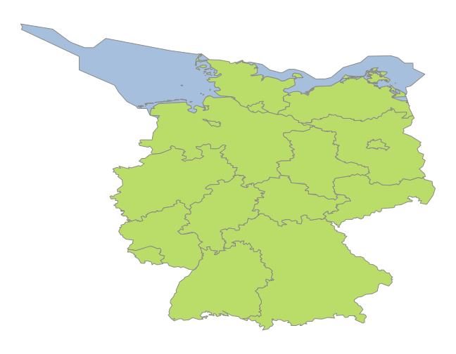

Usage
-----

There are two types of data functions in reegis. The high level functions
contain `by_region` functions, that make it possible to get data for a
specific region set.
Low level functions provide useful functions to get a pandas.DataFrame from
a specific data source. These functions may return more or less raw data.
Using pandas.DataFrame it is still pretty easy to process these tables to your
own needs.

The region set used in the following examples is the
federal state set. This set contains 17 regions (16 federal states plus one
offshore region).

Work in progress....